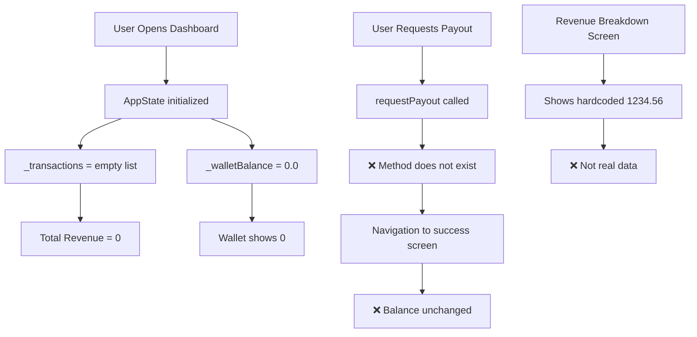
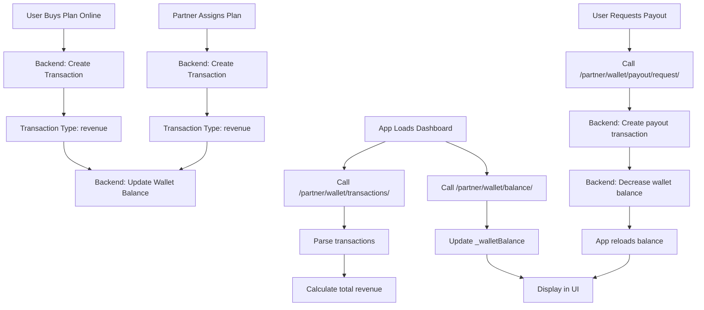

# Transaction and Revenue Flow Analysis

## Executive Summary

**Critical Finding**: The transaction and revenue system is **partially implemented** with significant gaps in data loading and wallet balance management.

### Key Issues Identified:
1. ❌ **No API methods** to load wallet balance from backend
2. ❌ **No API methods** to load transactions from backend  
3. ❌ **No wallet balance update** after payout requests
4. ❌ **Hardcoded revenue breakdown** values (not from API)
5. ✅ **UI components** are implemented and ready
6. ✅ **Transaction repository** exists with correct endpoints

---

## Metrics Overview

### 1. Total Revenue (Dashboard)
**Location**: `DashboardScreen` (lines 28-30)

```dart
final totalRevenue = appState.transactions
    .where((t) => t.type == 'revenue')
    .fold(0.0, (sum, t) => sum + t.amount);
```

**Current Implementation**:
- ✅ Calculated from `_transactions` list in `AppState`
- ❌ `_transactions` list is **never populated from API**
- ❌ Defaults to empty list, so total revenue always shows **0**

**Expected Flow**:
1. User buys plan online → Backend creates transaction
2. Partner assigns plan → Backend creates transaction  
3. App loads transactions via `/partner/wallet/transactions/`
4. Dashboard calculates total from loaded transactions

---

### 2. Wallet Balance

**Location**: `AppState` (line 126)

```dart
double _walletBalance = 0.0;
```

**Current Implementation**:
- ✅ Displayed in `WalletOverviewScreen` (line 96)
- ✅ Displayed in `PayoutRequestScreen` (line 116)
- ❌ **Never loaded from API**
- ❌ **Never updated after payout**
- ❌ Hardcoded to `0.0`

**Expected Flow**:
1. Revenue transactions increase wallet balance
2. Payout requests decrease wallet balance
3. Balance loaded from `/partner/wallet/balance/` (endpoint needs verification)

---

### 3. Payout Amount

**Location**: `PayoutRequestScreen`

**Current Implementation**:
- ✅ User can enter payout amount
- ✅ Fees calculated (2% for mobile money, 1.5% for bank)
- ✅ Final amount displayed
- ❌ `requestPayout` method **does not exist** in `AppState`
- ❌ No API call to submit payout request
- ❌ Wallet balance **not updated** after payout

**Code Reference** (line 365):
```dart
context.read<AppState>().requestPayout(_requestedAmount, _selectedMethod);
// ❌ This method DOES NOT EXIST
```

---

### 4. Revenue Breakdown

**Location**: `RevenueBreakdownScreen`

**Current Implementation**:
- ❌ **Completely hardcoded** values (lines 28, 38)
- ❌ Shows fake data: "1234.56" for assigned, "789.01" for online
- ❌ No API integration
- ❌ Transaction modal shows hardcoded sample transactions

**Hardcoded Values**:
```dart
'assigned_revenue': CurrencyUtils.formatPrice(1234.56, ...)  // ❌ Fake
'online_revenue': CurrencyUtils.formatPrice(789.01, ...)     // ❌ Fake
```

---

## API Endpoints Analysis

### Implemented Endpoints (Transaction Repository)

| Endpoint | Purpose | Status |
|----------|---------|--------|
| `/partner/wallet/transactions/` | Fetch all transactions | ✅ Repository method exists |
| `/partner/transactions/additional-devices/` | Device transactions | ✅ Repository method exists |
| `/partner/transactions/assigned-plans/` | Assigned plan transactions | ✅ Repository method exists |

### Missing Endpoints (Need Verification)

| Endpoint | Purpose | Status |
|----------|---------|--------|
| `/partner/wallet/balance/` | Get current wallet balance | ❓ Needs verification |
| `/partner/wallet/payout/request/` | Submit payout request | ❓ Needs verification |
| `/partner/revenue/breakdown/` | Get revenue by type | ❓ Needs verification |

---

## Data Flow Diagrams

### Current (Broken) Flow



### Expected (Correct) Flow



---

## Missing Components

### 1. AppState Methods (CRITICAL)

```dart
// ❌ MISSING in AppState
Future<void> loadWalletBalance() async {
  // Call API to get wallet balance
  // Update _walletBalance
}

Future<void> loadTransactions() async {
  // Call TransactionRepository.fetchTransactions()
  // Parse and store in _transactions
}

Future<void> requestPayout(double amount, String methodId) async {
  // Call API to submit payout request
  // Reload wallet balance
  // Reload transactions
}

Future<void> loadRevenueBreakdown() async {
  // Call API to get revenue by type (assigned vs online)
  // Return breakdown data
}
```

### 2. Transaction Repository Methods

```dart
// ❌ MISSING in TransactionRepository
Future<Map<String, dynamic>> getWalletBalance() async {
  final response = await _dio.get('/partner/wallet/balance/');
  return response.data;
}

Future<bool> submitPayoutRequest(Map<String, dynamic> payoutData) async {
  await _dio.post('/partner/wallet/payout/request/', data: payoutData);
  return true;
}

Future<Map<String, dynamic>> getRevenueBreakdown() async {
  final response = await _dio.get('/partner/revenue/breakdown/');
  return response.data;
}
```

### 3. Dashboard Data Loading

```dart
// ❌ MISSING: Dashboard initialization
@override
void initState() {
  super.initState();
  WidgetsBinding.instance.addPostFrameCallback((_) {
    final appState = context.read<AppState>();
    appState.loadWalletBalance();      // ❌ Does not exist
    appState.loadTransactions();       // ❌ Does not exist
  });
}
```

---

## Transaction Types

Based on the code analysis:

| Type | Description | Impact on Wallet |
|------|-------------|------------------|
| `revenue` | Plan purchase or assignment | ➕ Increases balance |
| `payout` | Withdrawal request | ➖ Decreases balance |
| `refund` | Plan refund | ➖ Decreases balance |

---

## Recommended Implementation Order

### Phase 1: Core Data Loading (HIGH PRIORITY)

1. **Add `loadWalletBalance()` to AppState**
   - Call `/partner/wallet/balance/`
   - Update `_walletBalance`
   - Notify listeners

2. **Add `loadTransactions()` to AppState**
   - Call `TransactionRepository.fetchTransactions()`
   - Parse response
   - Update `_transactions`
   - Notify listeners

3. **Update Dashboard `initState`**
   - Call `loadWalletBalance()`
   - Call `loadTransactions()`

### Phase 2: Payout Flow (HIGH PRIORITY)

4. **Add `submitPayoutRequest()` to TransactionRepository**
   - Endpoint: `/partner/wallet/payout/request/`
   - Payload: `{amount, payment_method_id}`

5. **Add `requestPayout()` to AppState**
   - Call repository method
   - Reload wallet balance
   - Reload transactions

6. **Fix `PayoutRequestScreen`**
   - Ensure `requestPayout` is called correctly
   - Add error handling

### Phase 3: Revenue Breakdown (MEDIUM PRIORITY)

7. **Add `loadRevenueBreakdown()` to AppState**
   - Call `/partner/revenue/breakdown/`
   - Return assigned vs online revenue

8. **Update `RevenueBreakdownScreen`**
   - Remove hardcoded values
   - Load real data from AppState

### Phase 4: Real-time Updates (LOW PRIORITY)

9. **Add refresh mechanisms**
   - Pull-to-refresh on all screens
   - Auto-refresh after actions

10. **Add transaction filtering**
    - By date range
    - By type (revenue/payout)
    - By status

---

## Testing Checklist

### Scenario 1: User Buys Plan Online
- [ ] Backend creates revenue transaction
- [ ] Transaction appears in `/partner/wallet/transactions/`
- [ ] Wallet balance increases
- [ ] Dashboard shows updated total revenue
- [ ] Revenue breakdown shows online revenue increase

### Scenario 2: Partner Assigns Plan
- [ ] Backend creates revenue transaction
- [ ] Transaction appears in `/partner/wallet/transactions/`
- [ ] Wallet balance increases
- [ ] Dashboard shows updated total revenue
- [ ] Revenue breakdown shows assigned revenue increase

### Scenario 3: Payout Request
- [ ] Payout request submitted to `/partner/wallet/payout/request/`
- [ ] Backend creates payout transaction
- [ ] Wallet balance decreases
- [ ] Transaction appears in history
- [ ] Success screen shows correct amount

---

## Backend Endpoint Verification Needed

Please verify these endpoints exist and provide their exact request/response formats:

1. **Wallet Balance**
   - Endpoint: `/partner/wallet/balance/`
   - Method: GET
   - Response: `{balance: number, currency: string}`

2. **Payout Request**
   - Endpoint: `/partner/wallet/payout/request/`
   - Method: POST
   - Payload: `{amount: number, payment_method_id: string}`
   - Response: `{id: string, status: string, amount: number}`

3. **Revenue Breakdown**
   - Endpoint: `/partner/revenue/breakdown/`
   - Method: GET
   - Response: `{assigned: number, online: number, total: number}`

---

## Summary

### Implemented ✅
- UI components (Dashboard, Wallet, Payout screens)
- Transaction model
- Transaction repository with endpoints
- Currency formatting
- Fee calculation

### Missing ❌
- Wallet balance loading from API
- Transaction loading from API
- Payout request submission
- Revenue breakdown API integration
- Wallet balance updates after transactions
- Real-time data refresh

### Next Steps
1. Verify backend endpoints
2. Implement `loadWalletBalance()` and `loadTransactions()` in AppState
3. Implement `requestPayout()` in AppState
4. Connect Revenue Breakdown to real API
5. Test complete flow end-to-end
